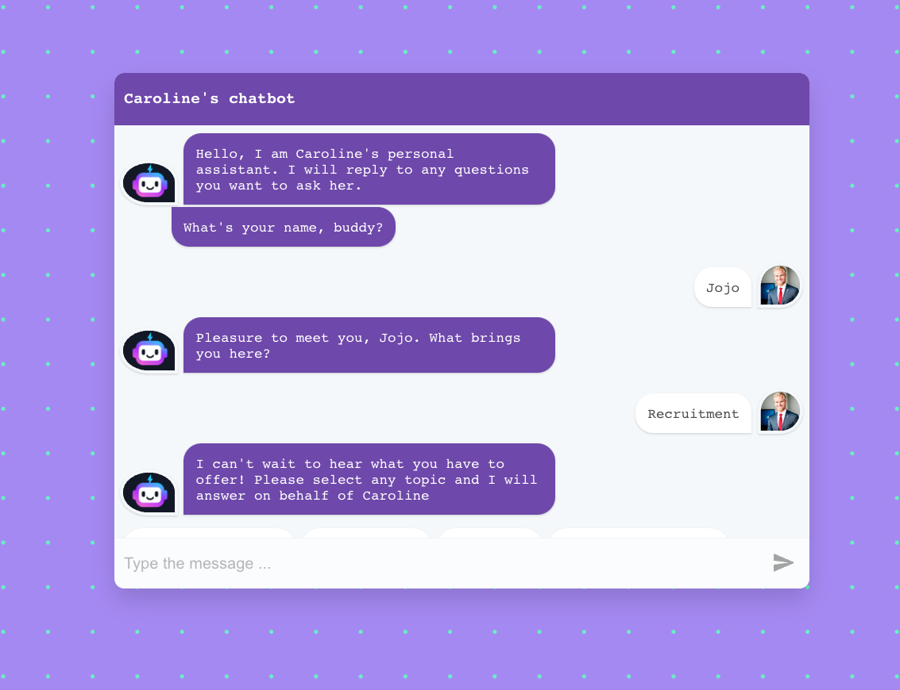
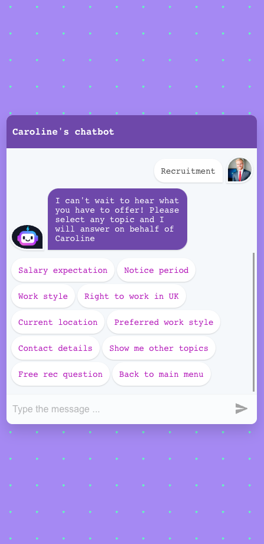
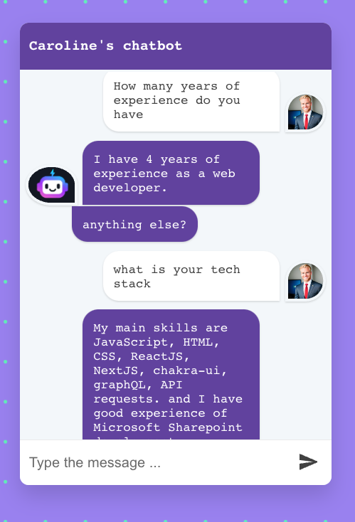

# 🤖 Say Hi to my virtual assistant

Personal project featuring a specialized chatbot and virtual assistant designed to handle queries from recruiters during the screening process, as well as engage in casual, non-work-related conversations. The chatbot offers various menus and clickable option tags for user interaction, including a feature for open-ended questions. It's important to note that the open questions in this chatbot are pre-defined and not powered by artificial intelligence.
Follow the bot prompts, select any options or enter text.

## ⚡️ Link to live app (release V.2) : https://notyourtypicaldeveloper.github.io/carolineVirtualAssitant/

## 📸 Screenshots

## ⚙️ Tech stack

- React-simple-chatbot (library)
- ReactJS
- JavaScript
- CSS

### Assets:

- AI generated user image
- Bot logo : credit to <a href="https://www.vecteezy.com/free-vector/chatbot-logo">Chatbot Logo Vectors by Vecteezy</a>

## ➕ Upcoming features:

- add a download CV button
- Create React component to be able to click on links

## To run the project on your local machine:

### `npm run dev`

Update all the env local variables

Runs the app in the development mode.\
Open [http://localhost:3000](http://localhost:3000) to view it in your browser.

The page will reload when you make changes.\
You may also see any lint errors in the console.
